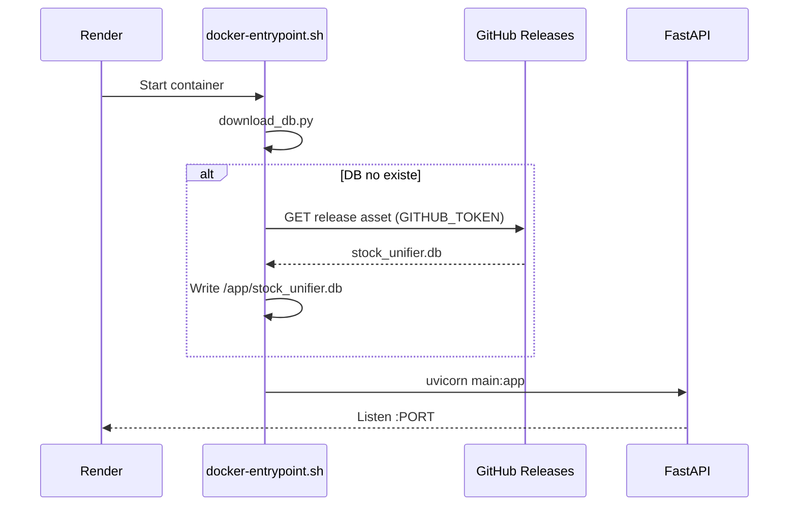

# Arquitectura — Stock Portfolio API

## Visión general

Sistema **polyrepo** con separación clara entre código, datos y frontend:

| Repo | Rol | Hosting |
|------|-----|---------|
| [stock-portfolio-api](https://github.com/Qleoz12/stock-portfolio-api) | Backend FastAPI | [Render](https://render.com) |
| [stock-portfolio-db](https://github.com/Qleoz12/stock-portfolio-db) | SQLite snapshots (Releases) | GitHub Releases (privado) |
| `stock-portfolio-web` (futuro) | Frontend Vue | GitHub Pages |
| `dataAnalitics/stock-portfolio-unifier` (local) | Desarrollo full-stack | Tu PC |

---

## Diagrama de despliegue

```
┌─────────────────────────────────────────────────────────────────┐
│                        DESARROLLO (local)                        │
│  dataAnalitics/stock-portfolio-unifier/                         │
│    backend/stock_unifier.db  ← trabajas aquí (7876+ stocks)     │
└────────────────────────────┬────────────────────────────────────┘
                             │ publish.ps1 (gh release)
                             ▼
┌─────────────────────────────────────────────────────────────────┐
│              GitHub: stock-portfolio-db (privado)                │
│    Release v1.0.0 → stock_unifier.db (~11 MB asset)             │
└────────────────────────────┬────────────────────────────────────┘
                             │ download_db.py + GITHUB_TOKEN
                             ▼
┌─────────────────────────────────────────────────────────────────┐
│              Render: stock-portfolio-api (Docker)                  │
│  docker-entrypoint.sh                                           │
│    1. ¿Existe /app/stock_unifier.db?                            │
│    2. Si no → descarga Release desde GitHub API                 │
│    3. uvicorn main:app :$PORT                                   │
│                                                                  │
│  URL: https://stock-portfolio-api-zecl.onrender.com             │
└────────────────────────────┬────────────────────────────────────┘
                             │ HTTPS /api/*
                             ▼
┌─────────────────────────────────────────────────────────────────┐
│              Frontend (futuro) — GitHub Pages                    │
│  VITE_API_URL → Render URL                                      │
└─────────────────────────────────────────────────────────────────┘
```

---

## Boot sequence (producción)



---

## Estructura del código (backend)

```
backend/
├── main.py                 # FastAPI app, health, ETL
├── config.py               # env vars, DATA_DIR, DB_PATH
├── database.py             # SQLAlchemy + SQLite
├── models.py               # ORM models
├── docker-entrypoint.sh    # boot: download DB + uvicorn
├── Dockerfile
├── routers/                # HTTP endpoints por dominio
│   ├── stocks.py
│   ├── portfolios.py
│   ├── dividends.py
│   ├── analytics.py
│   ├── arbitrage.py
│   ├── journal.py
│   ├── cluster_explorer.py
│   └── ...
├── services/               # lógica de negocio
├── analytics/              # clustering, features, export
├── etl/                    # pipeline CSV → DB (solo bootstrap)
└── scripts/
    └── download_db.py      # descarga Release en boot
```

---

## Módulos API (prefijos)

| Prefijo | Módulo | Descripción |
|---------|--------|-------------|
| `/api/health` | main | Health + stocks_count |
| `/api/stocks` | stocks, charts, fair_value, valuation | Screener, OHLCV, fair value |
| `/api/portfolios` | portfolios | Carteras y holdings |
| `/api/dividends` | dividends | Calendario, notas |
| `/api/analytics` | analytics | Dashboard, yields |
| `/api/arbitrage` | arbitrage | Rates, P2P, ops |
| `/api/journal` | journal | Bitácora unificada |
| `/api/cluster` | cluster_explorer | Clustering / ML |
| `/api/market` | market_charts | Sector charts |
| `/api/forex` | forex | FX dashboard |
| `/api/limitless` | limitless | Prediction markets |
| `/api/polymarket` | polymarket | Polymarket search |
| `/api/news-sentiment` | news_sentiment | Sentiment por stock |
| `/api/x-feeds` | x_feeds | X/Twitter feeds |

---

## Variables de entorno

| Variable | Local | Render | Secreto |
|----------|-------|--------|---------|
| `DATABASE_PATH` | `backend/stock_unifier.db` | `/app/stock_unifier.db` | No |
| `GITHUB_TOKEN` | — | PAT read en `stock-portfolio-db` | **Sí** |
| `DB_REPO` | `Qleoz12/stock-portfolio-db` | igual | No |
| `DB_RELEASE_TAG` | `v1.0.0` | igual | No |
| `DB_ASSET_NAME` | `stock_unifier.db` | igual | No |
| `CORS_ORIGINS` | `http://localhost:5173` | URL frontend | No |
| `FINNHUB_API_KEY` | opcional | opcional | Sí |
| `LIMITLESS_API_KEY` | opcional | opcional | Sí |

---

## Flujos operativos

### Deploy código (automático)

```
git push main → Render auto-deploy → Docker build → boot → API live
```

GitHub Actions adicional: `ci.yml` (tests) + `production-smoke.yml` (health check).

### Actualizar DB en producción

```
1. Trabajar en local (dataAnalitics/.../backend/stock_unifier.db)
2. stock-portfolio-db: .\publish.ps1 -Tag v1.0.1
3. Render: DB_RELEASE_TAG=v1.0.1
4. Manual Deploy (re-descarga DB al boot)
```

### Desarrollo local

```
1. Copiar o usar DB de dataAnalitics
2. cd backend && pip install -r requirements.txt
3. set DATABASE_PATH=stock_unifier.db
4. python main.py
```

---

## Limitaciones (plan Render Free)

- **Cold start:** ~30–60 s sin tráfico
- **Disco efímero:** DB se re-descarga en cada redeploy
- **Sin SSH / persistent disk** en free tier

---

## Automatización disponible

| Qué | Cómo | Trigger |
|-----|------|---------|
| Deploy API | Render ↔ GitHub | push `main` |
| Tests unitarios | GitHub Actions `ci.yml` | push / PR |
| Smoke test producción | GitHub Actions `production-smoke.yml` | push `main` |
| Publicar DB | `publish.ps1` en `stock-portfolio-db` | manual |
| Probar API local | `scripts/test_api.py` | manual |

### Futuro (opcional)

- GitHub Action en `stock-portfolio-db` para publicar release con `workflow_dispatch`
- Frontend en GitHub Pages con Action que build + deploy
- Render Starter + disco persistente (sin re-download cada deploy)
